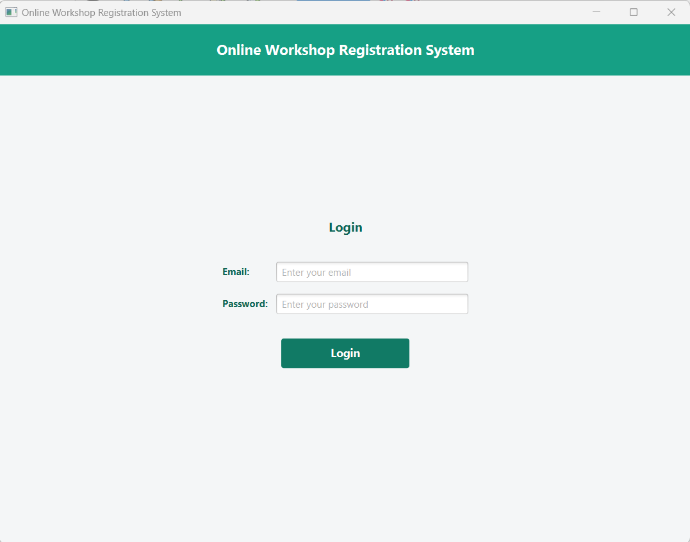
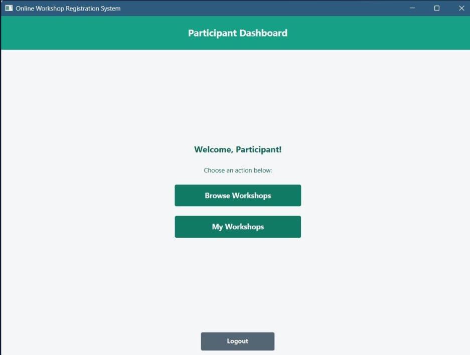
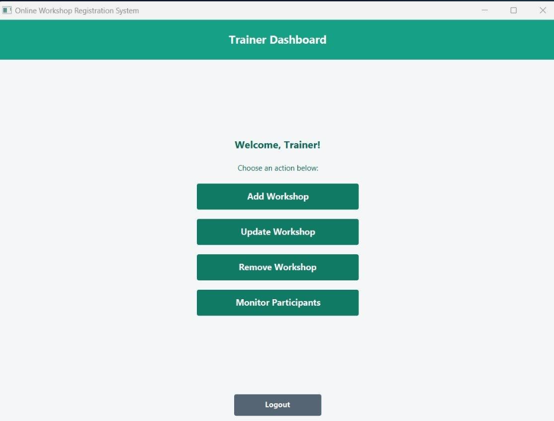
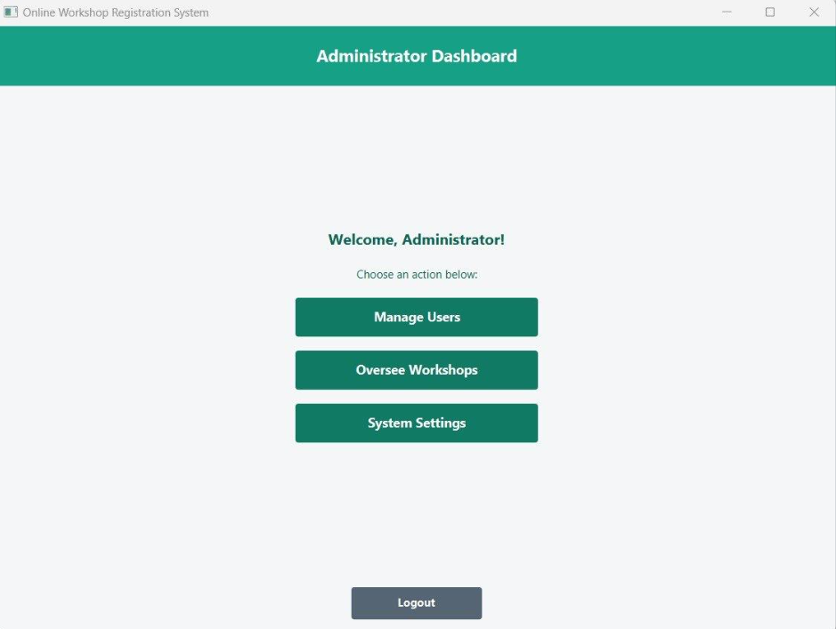
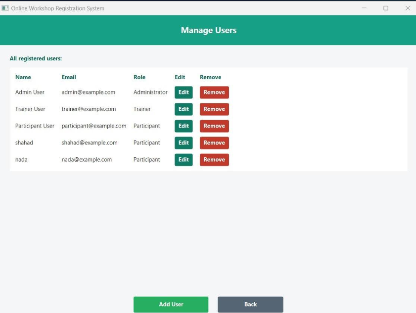

# Online Workshop Registration System

A desktop application developed as an academic project for managing online workshops and registrations.

## Features
- Role-based access for Participants, Trainers, and Administrators
- Workshop creation and management
- Workshop registration and withdrawal
- User and participant management
- MySQL database integration
- Graphical user interface using JavaFX

## Technologies
- Java
- JavaFX
- MySQL
- FXML
- NetBeans

## Project Overview
The system allows participants to browse and register for workshops, trainers to manage workshops and participants, and administrators to manage users and oversee the system.

## Academic Project
Developed as part of the Advanced Programming course.

## How to Run

1. Clone or download this repository.
2. Open the project in NetBeans.
3. Make sure MySQL Server is installed and running.
4. Create the database by running the provided `database_script.sql` file.
5. Open `src/dao/DatabaseConnection.java` and replace `YOUR_PASSWORD` with your MySQL password.
6. Make sure the MySQL JDBC Driver is added to the project libraries.
7. Build and run the project in NetBeans.

## Screenshots

### Login

### Participant Dashboard

### Trainer Dashboard

### Administrator Dashboard

### Manage Users

